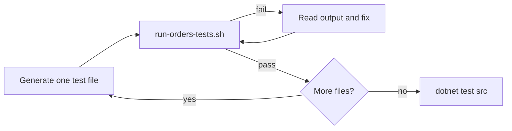

# Cloud Agent 2 — Regenerate Order Service Tests

Use this prompt for the "generator" agent. It must start from the orphan baseline with no test history.

## Starting point

- Branch: `demo/no-tests-orders` (single orphan commit, no Orders test files)
- Do NOT checkout or read `demo/ground-truth-orders-tests`

## Prompt

```
Write NUnit tests for nopCommerce order services under:
  src/Tests/Nop.Tests/Nop.Services.Tests/Orders/

Starting branch has NO files in that folder. Rebuild test coverage by reading production code only:
  src/Libraries/Nop.Services/Orders/

Requirements:
1. Each test class inherits from ServiceTest (not BaseNopTest directly)
2. Use NUnit, AwesomeAssertions, and patterns from sibling folders (e.g. Nop.Services.Tests/Catalog/)
3. Namespace: Nop.Tests.Nop.Services.Tests.Orders
4. One test file per existing service area (6 files total):
   - OrderCustomValuesTests.cs
   - GiftCardServiceTests.cs
   - CheckoutAttributeParserAndFormatterTests.cs
   - OrderServiceTests.cs
   - OrderTotalCalculationServiceTests.cs
   - OrderProcessingServiceTests.cs

Generation order (easiest first):
1. OrderCustomValuesTests.cs
2. GiftCardServiceTests.cs
3. CheckoutAttributeParserAndFormatterTests.cs
4. OrderServiceTests.cs
5. OrderTotalCalculationServiceTests.cs
6. OrderProcessingServiceTests.cs

After EACH file:
  ./scripts/demo/run-orders-tests.sh
If tests fail, read the output, fix the test file, and re-run until green before moving on.

After ALL files:
  dotnet restore src
  dotnet build --no-restore --configuration Release src
  dotnet test --no-build --configuration Release --verbosity normal src

The full suite must pass with no regressions outside Orders.

Do not copy test files from git history — they do not exist on this branch. Infer behavior from:
  - Public methods on order services
  - Domain enums (OrderStatus, PaymentStatus, ShippingStatus)
  - Existing ServiceTest fake plugins (TestPaymentMethod, etc.)
```

## Validation loop



## Key infrastructure notes

- `ServiceTest` initializes fake tax, shipping, payment, discount, and exchange-rate plugins required by order flows
- `OrderProcessingServiceTests` uses `TestPaymentMethod` flags (`TestSupportRefund`, etc.) — reset in `[OneTimeTearDown]`
- Order tests hit SQLite via `BaseNopTest` — first run is slow; subsequent runs are faster

## Success criteria

- `./scripts/demo/run-orders-tests.sh` passes
- Full `dotnet test src` passes
- Tests cover meaningful order behaviors (not just smoke constructors)
